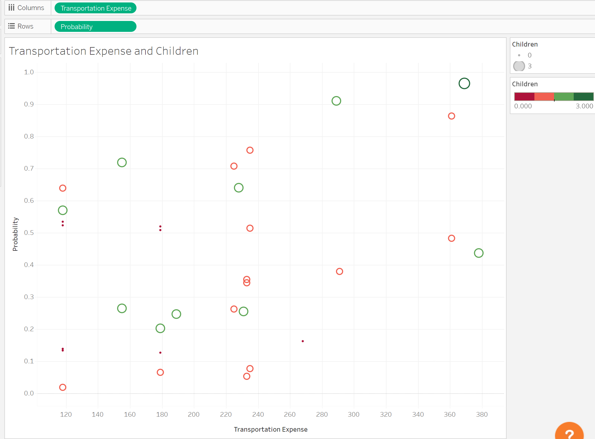

# 📊 Tableau Visualization Analysis

## 📈 Age vs. Probability Analysis

- Analysis revealed that employees aged 40 years or younger formed the majority of the dataset
- The visualization showed varying probabilities of excessive absence across different age groups
- For specific age groups (e.g., 31-year-olds), the model predicted only a 29% chance of excessive absence (>3 hours)

## 🏥 Reasons for Absence Analysis

### Group 1 (Serious Medical Conditions)
- Demonstrated strong predictive power with probability >50% for excessive absence
- Showed clear correlation between serious medical conditions and extended absences
- Qualitative analysis matched quantitative findings, validating the model's predictions

### Group 2 ⚠️
- Insufficient data for analysis (all values were zero)
- Excluded from final analysis due to lack of observations

### Group 3 📝
- Limited predictive value due to sparse data distribution
- Showed mixed probability distribution across both high and low ranges
- Insufficient data to draw concrete conclusions

### Group 4 (Light Medical Reasons) 🩺
- Consistently showed probability below 50% for excessive absence
- Included routine medical visits (dental appointments, physiotherapy, consultations)
- Demonstrated logical correlation between minor medical issues and shorter absences

## 🚗 Transportation Expense and Children Analysis

### Transportation Patterns
- Identified a positive correlation between transportation expenses and absence probability
- Most employees spent between $220-240 monthly on transportation
- Only five observations exceeded the $240 transportation expense threshold

### 👨‍👩‍👧‍👦 Family Size Impact
#### No Children 👤
- Generally showed lower probability of excessive absence
- Typically had lower transportation expenses
- More consistent attendance patterns

#### 1-2 Children 👨‍👩‍👧
- Showed varied absence probabilities
- Majority clustered around average transportation expenses
- Demonstrated similar distribution patterns between both groups

#### 3+ Children 👨‍👩‍👧‍👦
- Limited data (single observation)
- Insufficient for meaningful analysis
- Excluded from final conclusions

## 🎯 Key Model Insights
1. The strongest predictive factors for excessive absence were:
   - Serious medical conditions (Group 1 reasons)
   - Transportation expenses
   - Family size (number of children)

2. Model limitations:
   - Limited data in some categories (Group 2 reasons, 3+ children)
   - Some correlations could be stronger with larger dataset
   - Certain variables showed mixed or inconclusive patterns
